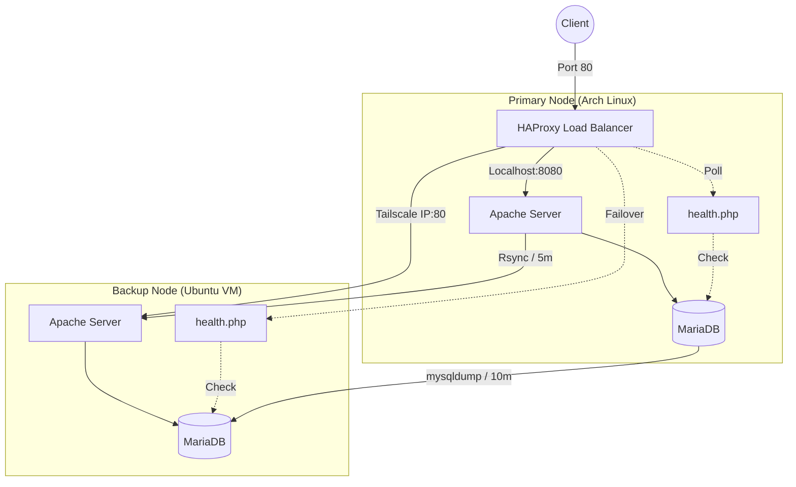

# Iris — High-Availability Web Infrastructure

[](LICENSE)
[](https://www.utoledo.edu/)

**Iris** is a research-backed, low-cost high-availability (HA) LAMP stack designed for resource-constrained environments. It leverages open-source tools to provide fault tolerance and automated failover across heterogeneous nodes (Arch Linux + Ubuntu VM) connected via an encrypted Tailscale overlay network.

---

## 🏗️ System Architecture

Iris utilizes a **Primary/Backup** model with eventual consistency, managed by an intelligent load balancer.



### Key Components
- **Load Balancer**: HAProxy for intelligent health monitoring and failover.
- **Networking**: Tailscale for encrypted P2P connectivity between nodes.
- **Web Stack**: Linux, Apache, MariaDB, PHP (LAMP).
- **Sync Engine**: Rsync (files) and Mysqldump (database) automated via Cron/Inotify.

---

## 📊 Research Results

Based on the evaluation in **[docs/Paper-IRIS.pdf](docs/Paper-IRIS.pdf)**, the system achieves the following benchmarks:

| Metric | Result |
| :--- | :--- |
| **Failover Response Time** | ≈ 3 Seconds |
| **Failback Recovery Time** | ≈ 5 Seconds |
| **Primary Latency** | ~0.010s |
| **Backup Latency** | ~0.012s (+0.002s overhead) |
| **Data Consistency** | Eventual (5-10m propagation) |

---

## 📂 Repository Structure

```text
.
├── src/                # Web Application Source
│   ├── index.php       # Landing Page
│   ├── identity.php    # Node Identification
│   └── health.php      # Failover Health Check
├── config/             # System Configurations
│   ├── haproxy.cfg     # HAProxy failover rules
│   ├── apache.conf     # Apache vhost examples
│   └── cron-schedule   # Automation schedule
├── scripts/            # Automation Logic
│   ├── sync_files.sh   # File replication
│   ├── sync_db.sh      # Database replication
│   └── watch_sync.sh   # [NEW] Continuous sync engine
├── sql/                # Database Artifacts
│   ├── schema.sql      # Database structure
│   └── seeds.sql       # Test data
├── docs/               # Research Documentation
│   ├── Paper-IRIS.pdf   # Full research paper
│   └── figures/        # Verification screenshots
└── .env.example        # Configuration template
```

---

## 🚀 Quick Start

### 1. Prerequisites
- **Primary**: Arch Linux (or similar)
- **Backup**: Ubuntu Server (Local or VM)
- **Shared**: Tailscale, Apache, MariaDB, HAProxy

### 2. Deployment
1. **Clone & Setup**:
   ```bash
   git clone https://github.com/rajdangi31/iris-lamp.git
   cp .env.example .env
   # Edit .env with your Tailscale IPs and DB credentials
   ```

2. **Backend Config**:
   Deploy the `src/` directory to `/var/www/html/` on both nodes. Ensure `identity.php` is unique to each node to verify routing.

3. **Load Balancer**:
   Apply `config/haproxy.cfg` to your primary node:
   ```bash
   sudo cp config/haproxy.cfg /etc/haproxy/haproxy.cfg
   sudo systemctl restart haproxy
   ```

4. **Synchronization**:
   Enable the periodic sync via crontab or use the new continuous sync:
   ```bash
   bash scripts/watch_sync.sh
   ```

---

## 📄 License
Distributed under the Apache 2.0 License. See `LICENSE` for more information.
